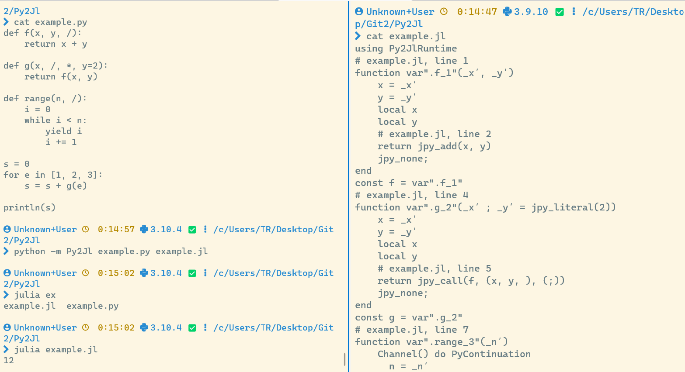

## Python To Julia Transpiler



This project aims at providing a Py2Jl transpiler targeting the compatibility level 1 and 2 mentioned in the section [#CPython Compatibility Level](#cpython-compatibility-level), while the methods to support libraries like `numpy`, `scipy` or `pytorch` will be given in the documentation.

This project is in its early stage, and now we have only partly achieved the level 1 compatibility. This means that you can already write performant Julia code using pure Python, but you might not succeed in transforming any existing Python codebase to Julia with this tool.

## Usage

```bash
python -m Py2Jl input.py output.jl
```

To run the generated Julia code, you should add the package `Py2JlRuntime` to your environment (e.g., `pkg> dev runtime-support/Py2JlRuntime`). 
The package `Py2JlRuntime` is included in the `runtime-support` folder.


## CPython Compatibility Level

1. Level 1: trivial transformation for seemingly similar code correspondence. With this level, Python code transpiled to Julia usually does not work the same.

2. Level 2: semantics-driven transformation that respects the Python languages semantics and behaviours. With this level, Pure Python code transpiled to Julia strictly works the same.

3. Level 3: the transpiler respects the original execution model of CPython. such as some unusual functions in the `inspect` module, `sys._getframe`. This level is usually forcing the transpiler to use the same or similar object models as the original CPython, which has negative performance implications.

4. Level 4: the transpiler respects the original object memory layout of CPython. This means the transpiler becomes a replication of the original CPython, which is too boring. This level also fully supports C-extensions, but it is not the only approach.


