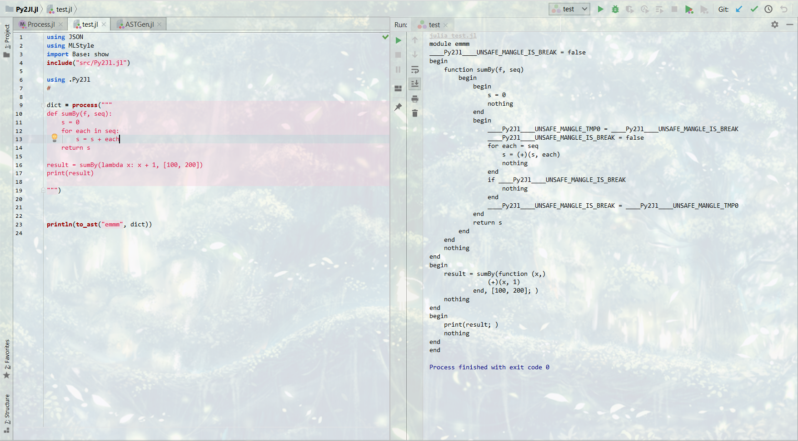

# Py2Jl
Python to Julia transpiler.

## Motivation

For packages written in Julia are quite few, and Python is exactly a subset of Julia except some implementation details, it's natural to think about taking advantage of existed Python codebase in Julia ecosystem so that we can have enormous powerful and battle-tested packages.

## Stage

Currently, we can transpile a single python module with limited constructs into Julia.

## Supported Features
- All the basic constructs like `if-else`, `for`, `while`...
- `while-else`, `for-else` constructs
- Function invocation with keyword args and varadic args.
- Arbitrary `try-except`
- Annotation(but not equivalent to Julia's)

## Not Implmeneted Features

- Function definitions with keyword args(both `kwargs` and so-called `keyword arg`), default args and varadic args.
- Classes
- Imports(Dynamically import mechansim might not be supported forever)
- Attributes(`obj.attr`)

