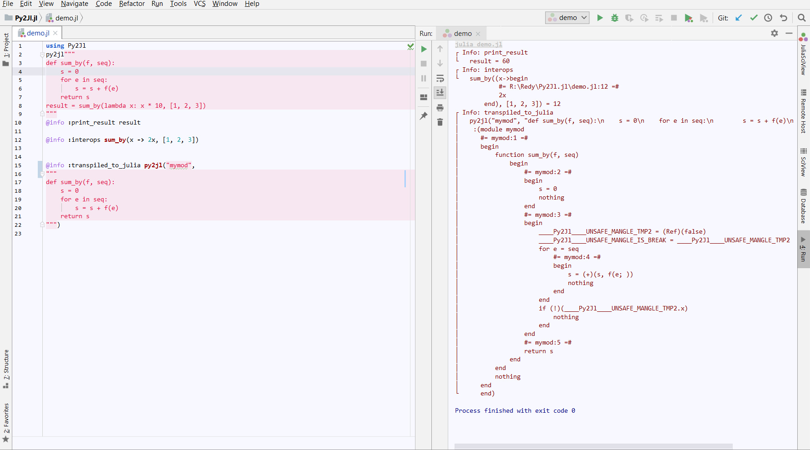

## Notes

This package has been suspended.

You might want to check out [py2many](https://github.com/adsharma/py2many) for Python-to-Julia transpilation.

# Py2Jl


Python-to-Julia transpiler. Python 3 semantics are used (see below).

[](./preview.png)

## Usage

For now, because of a bug in Julia itself, long-term-support (LTS) versions of Julia, e.g. Julia 1.0.4 and 1.0.0 do not work. The package intends to support LTS Julia too, and will as soon as Julia is fixed.

Th package now works on 1.1.x, and before on [Julia 1.1.0-rc2](https://julialang-s3.julialang.org/bin/linux/x64/1.1/julia-1.1.0-rc2-linux-x86_64.tar.gz), but earlier versions, at least those named LTS ones, do segfault.

```shell
pkg> add Py2Jl
```

To demonstrate, open a file (check out [demo.jl](./demo.jl)) and write

```julia
using Py2Jl

py2jl"""
def sum_by(f, seq):
    s = 0
    for e in seq:
        s = s + f(e)
    return s
"""
@info sum_by(x -> 2x, [1, 2, 3]) # 12

@info py2jl("mymod", """
def sum_by(f, seq):
    s = 0
    for e in seq:
        s = s + e
    return s
""")
```

Then type `julia demo.jl` in your shell to see the results.

## Motivation

Since packages written in Julia are quite few, and Python is exactly a subset of 
Julia despite some implementation details, it's natural to think about taking
advantage of existing Python codebase in Julia ecosystem so that we can have a
great number of powerful and battle-tested packages.

## Status

Currently, we can transpile a single Python module with limited constructs into 
Julia ones.

## Supported Features

- All the basic constructs like `if-else`, `for`, `while`, etc
- `while-else`, `for-else` constructs
- Function invocation with keyword args and variadic args
- Arbitrary `try-except`s
- Annotation (but not equivalent to Julia's)

## Not Implemented (yet) Features

- Function definitions with keyword args (both `kwargs` and so-called
`keyword arg`), default args and variadic args
- Classes
- Imports (dynamically importing might not be supported forever)
- Attributes (`obj.attr`)
- Python-compatible built-in functions like `map`, `print` and many standard
libs

## Python 3 vs. older Python

Most of the differences between Python 2 and Python 3 do not matter, as not yet implemented. E.g. this valid Python 2 code translates, but with Python 3 semantics:

```
julia> py2jl"""
       def divide_by_two(x):
         return x/2
       """

julia> divide_by_two(9)  # Python 2, unlike Python 3 and Julia would return 4.
4.5
```
